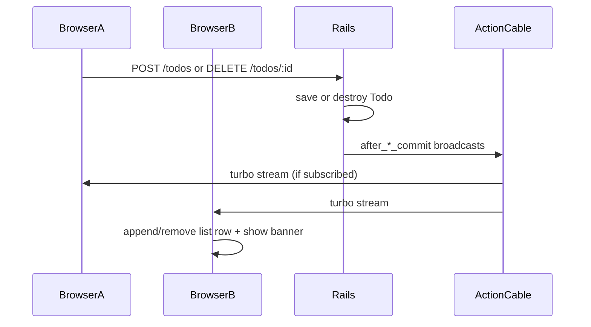

# Real-time todo add/delete notifications

## Approach

Use **Turbo Streams** over **Action Cable** (already provided by `turbo-rails`; production uses **Solid Cable** per [`config/cable.yml`](config/cable.yml)). No new gems and **no migration**—broadcasts are ephemeral messages, not stored rows.

**Why model callbacks:** [`TodosController#create`](app/controllers/todos_controller.rb) and [`#destroy`](app/controllers/todos_controller.rb) already persist records; `after_create_commit` / `after_destroy_commit` on [`Todo`](app/models/todo.rb) fire for HTML and JSON and keep the controller thin (matches project conventions).

**Development note:** `development` uses the `async` cable adapter (same Puma process). Multiple tabs on one machine work; multiple server processes would need Solid Cable in dev too (optional config change, not required for homework).

---

## Numbered changes

### 1. Refactor index markup for consistent broadcast targets

**Problem:** [`index.html.erb`](app/views/todos/index.html.erb) renders [`_todo.html.erb`](app/views/todos/_todo.html.erb) plus a separate `
` “Show this todo” link. `broadcast_remove` only removes one DOM node; the orphan `
` would remain.

**Edit:** [`app/views/todos/index.html.erb`](app/views/todos/index.html.erb) — wrap each item in a single container (e.g. render a new row partial once per todo).

**Add:** `app/views/todos/_todo_row.html.erb` — outer element with a stable `dom_id` (e.g. `dom_id(todo, :row)`), inner render of `_todo`, plus the “Show this todo” link.

**Keep:** [`_todo.html.erb`](app/views/todos/_todo.html.erb) as the description block (or fold into row partial if simpler—just keep one canonical partial used by both index and broadcasts).

### 2. Subscribe all pages to the todos stream

**Edit:** [`app/views/layouts/application.html.erb`](app/views/layouts/application.html.erb) — add `turbo_stream_from "todos"` in `<body>` so any open tab receives notifications, not only `/todos`.

Add a persistent target for banners, e.g. `

` above `yield`.

### 3. Wire the index list as the broadcast target

**Edit:** [`app/views/todos/index.html.erb`](app/views/todos/index.html.erb) — ensure the list container has `id="todos"` (already present at line 7) and renders `_todo_row` for each `@todo`.

### 4. Broadcast list changes and notification messages from the model

**Edit:** [`app/models/todo.rb`](app/models/todo.rb) — include Turbo broadcast behavior (via `Turbo::Broadcastable` / Rails 8 defaults on `ApplicationRecord`).

On **`after_create_commit`:**

- `broadcast_append_to "todos", target: "todos", partial: "todos/todo_row", locals: { todo: self }` (or equivalent `broadcasts_to` configuration with the same partial).
- `broadcast_append_to "todos", target: "todo_notifications", partial: "todos/notification", locals: { message: ... }` with a clear message (e.g. “Todo added: …”), escaping handled by ERB (no `html_safe` on user text).

On **`after_destroy_commit`:**

- `broadcast_remove_to "todos", target: dom_id(self, :row)` (must match the row wrapper id from step 1).
- `broadcast_append_to "todos", target: "todo_notifications", partial: "todos/notification", locals: { message: ... }` (e.g. “Todo removed: …” using `description` captured before destroy if needed).

**No controller changes required** unless you prefer broadcasts in the controller; model callbacks are sufficient and keep [`create`](app/controllers/todos_controller.rb) / [`destroy`](app/controllers/todos_controller.rb) redirects unchanged.

### 5. Add notification partial

**Add:** `app/views/todos/_notification.html.erb` — one dismissible or simple alert row (plain ERB, default escaping). Optional tiny Stimulus controller to auto-fade—only if you want polish; not required for the assignment.

### 6. Optional CSS

**Edit:** [`app/assets/stylesheets/application.css`](app/assets/stylesheets/application.css) — minimal styles for `#todo_notifications` and list rows so banners are visible (small diff).

### 7. Migration

**None.** Solid Cable tables already exist in [`db/cable_schema.rb`](db/cable_schema.rb) for production; development/test use `async` / `test` adapters. The `todos` table schema is unchanged.

### 8. Tests

**Edit:** [`test/test_helper.rb`](test/test_helper.rb) — include Turbo stream broadcast test helpers if not already available (e.g. `Turbo::Broadcastable::TestHelper` / `ActionCable::TestHelper` per current `turbo-rails` docs).

**Edit:** [`test/models/todo_test.rb`](test/models/todo_test.rb) — replace placeholder with:

| Test | Asserts |
|------|---------|
| `create` broadcasts append to `"todos"` stream | `assert_turbo_stream_broadcasts "todos"` (or assert specific stream actions) inside `Todo.create!` |
| `destroy` broadcasts remove + notification | same helper around `todo.destroy` |
| Optional | broadcast payloads reference `todo_row` / `notification` partials |

**Edit:** [`test/controllers/todos_controller_test.rb`](test/controllers/todos_controller_test.rb) — existing create/destroy tests should still pass (redirects unchanged). Optionally add one test that POST/DELETE triggers expected broadcast count (integration-level).

**Edit:** [`test/system/todos_test.rb`](test/system/todos_test.rb) — optional manual QA test: document that true multi-browser sync is verified manually; automated two-session system tests are heavy for this homework. At minimum, keep existing system tests green.

**No new fixture files** unless you add model validations later.

### 9. Manual verification (not code)

1. Start server (`bin/dev` or `bin/rails server`).
2. Open `/todos` in two browser windows.
3. Create a todo in window A → window B list grows and banner appears.
4. Destroy from window A (show page) → window B row disappears and banner appears.

Run: `bin/rails test` and `bin/rails test:system`.

---

## Files summary

| Action | File |
|--------|------|
| Edit | [`app/models/todo.rb`](app/models/todo.rb) |
| Edit | [`app/views/todos/index.html.erb`](app/views/todos/index.html.erb) |
| Edit | [`app/views/layouts/application.html.erb`](app/views/layouts/application.html.erb) |
| Edit | [`app/assets/stylesheets/application.css`](app/assets/stylesheets/application.css) (optional) |
| Edit | [`test/test_helper.rb`](test/test_helper.rb) |
| Edit | [`test/models/todo_test.rb`](test/models/todo_test.rb) |
| Edit | [`test/controllers/todos_controller_test.rb`](test/controllers/todos_controller_test.rb) (optional broadcast assertion) |
| Add | `app/views/todos/_todo_row.html.erb` |
| Add | `app/views/todos/_notification.html.erb` |
| Unchanged | [`config/routes.rb`](config/routes.rb), [`TodosController`](app/controllers/todos_controller.rb) (unless you choose controller-side broadcasts) |

## Out of scope (per project rules)

- No new gems (Redis, AnyCable, etc.).
- No `User` model or per-user channels (no auth in app).
- No email/push notifications.
- No DB table for notification history.
